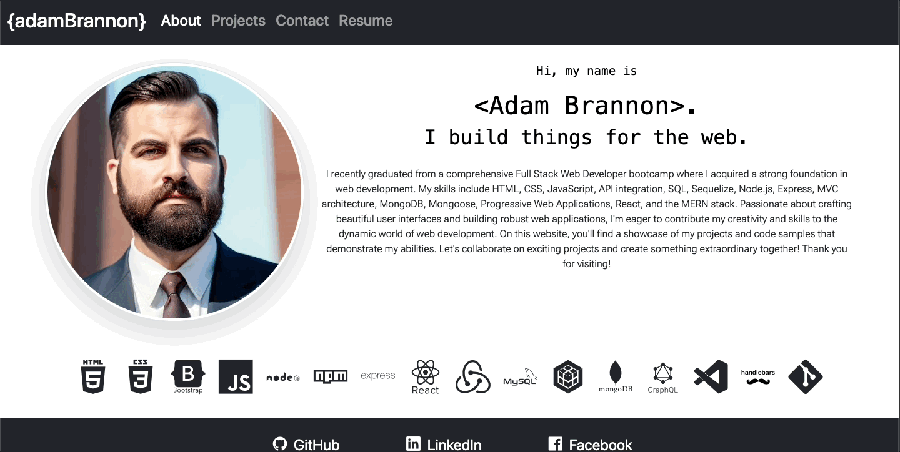

<link rel="stylesheet" href="https://cdn.jsdelivr.net/gh/devicons/devicon@v2.15.1/devicon.min.css">
<link rel="stylesheet" href="https://cdn.jsdelivr.net/gh/devicons/devicon@v2.15.1/devicon.min.css">
          
          
# My React Portfolio 

## Description
Welcome to my portfolio! I'm Adam Brannon, a proficient React developer with a keen sense of innovation. In crafting my portfolio, I've harnessed the power of Bootstrap to create a sleek, responsive design that ensures a smooth and enjoyable user experience. 

Upon exploring, you'll come across my 'About Me' page which offers a comprehensive look into my professional journey and personal ethos. My portfolio page is where you'll find a carefully curated collection of my work, each accompanied by links to the deployed applications and their respective GitHub repositories. This provides a peek into the detail and quality of my code and the contributions I've made to various projects.

I've also included a 'Contact' page, simplifying the process for any potential employers or collaborators to reach out to me. As an added convenience, you'll find my detailed resume, downloadable for your future reference.

All in all, this portfolio is a testament to my abilities and dedication as a React developer, highlighting my passion for creating top-notch web applications. Enjoy exploring! 

## Quick Links

- [Installation](#installation)
  
- [Usage](#usage)

- [Technologies](#technologies)

- [Demo](#demo)
  
- [Contributors](#contributors)
  
- [Feedback and Support](#feedback-and-support)
  
- [License](#license)

## Installation

No install required for the web-based version. To run the application locally, clone the repository to your local machine

## Usage

To use the web-based version no installation is required. Simply navigate to the deployed application [URL](https://adam-brannon09.github.io/react_portfolio/) and begin using the app in your browser.

## Technologies

<i class="devicon-javascript-plain" style=font-size:7rem></i></img>
<i class="devicon-react-original-wordmark" style=font-size:7rem></i></img>
<i class="devicon-bootstrap-plain-wordmark" style=font-size:7rem></i></img>

          

## Demo

Follow me to the [Deployed Application](https://adam-brannon09.github.io/react_portfolio/)

## Contributors
Adam Brannon

[Check me out on Github](https://github.com/adam-brannon09)

[Email Me](mailto:adam.brannon09@icloud.com)

## Feedback and Support

If you encounter any issues while viewing my portfolio or have any suggestions for improvement, please [open an issue](https://github.com/adam-brannon09/react_portfolio/issues) on the GitHub repository. I appreciate your feedback and will address any concerns as soon as possible.

## License

The Google Books API Application is released under the [MIT License](https://opensource.org/licenses/MIT). You are free to use, modify, and distribute this application as per the terms of this license.

    

